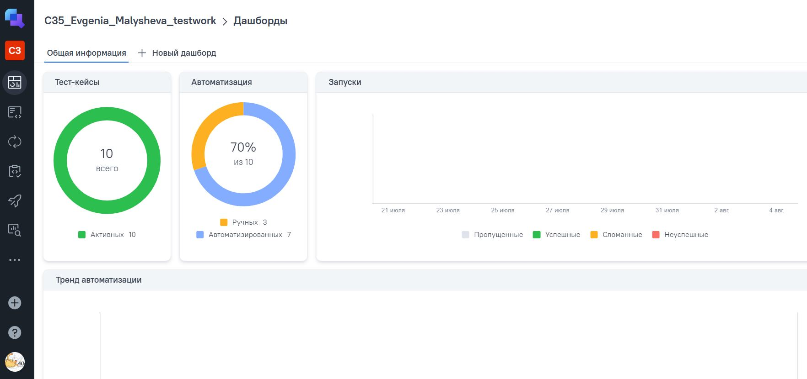

<a href="https://litres.ru/ ">  
<h2 >Проект по автоматизации тестирования для компании <a href="https://testcompany.ru/ "> Litres</a></h2> 
Литрес – цифровой сервис электронных и аудиокниг, а также другого контента: подкасты, спектакли, интервью – скачивай, читай и слушай на любых устройствах.

## ☑️ Содержание:

- Технологии и инструменты
- Список проверок, реализованных в тестах
- Запуск тестов (сборка в Jenkins) и из терминала
- Allure отчет
- AllureTestOps дашборд
- Уведомление в Telegram о результатах прогона тестов
- Видео пример прохождения тестов

<a id="tools"></a>
## :ballot_box_with_check:Технологии и инструменты:

|         Java                                                                                                      | IntelliJ  <br>  Idea                                                                                               | GitHub                                                                                                     | JUnit 5                                                                                                           | Gradle                                                                                                     | Selenide                                                                                                         | Selenoid                                                                                                                  | Allure <br> Report                                                                                                         | Allure <br> TestOps                                                                                                         |  Jenkins                                                                                                        |   Telegram
|:----------------------------------------------------------------------------------------------------------|--------------------------------------------------------------------------------------------------------------------|------------------------------------------------------------------------------------------------------------|-------------------------------------------------------------------------------------------------------------------|------------------------------------------------------------------------------------------------------------|------------------------------------------------------------------------------------------------------------------|---------------------------------------------------------------------------------------------------------------------------|----------------------------------------------------------------------------------------------------------------------------|-----------------------------------------------------------------------------------------------------------------|-----------------------------------------------------------------------------------------------------------------|---------------------------------------------------------------------------------------------------------------------|
| <a href="https://www.java.com/"></a>  | <a href="https://www.jetbrains.com/idea/"></a> | <a href="https://github.com/"></a> | <a href="https://junit.org/junit5/"></a> | <a href="https://gradle.org/"></a> | <a href="https://selenide.org/"></a> | <a href="https://aerokube.com/selenoid/"></a> | <a href="https://github.com/allure-framework"></a> |<a href="https://qameta.io/"></a> | <a href="https://www.jenkins.io/"></a> | <a href="https://web.telegram.org/"></a> |

<a id="cases"></a>
## :ballot_box_with_check: Реализованные проверки:
Реализованные UI-тесты:
- Проверка на непустой результат поиска книг
- Поиск определенной серии книг 
- Поиск определенной книги
- Проверка страницы ввода промокода
- Поиск раздела Переговоры в выпадающем каталоге
- Переход в сторонний ресурс из футера страницы
- Просмотр условий промо-акции

##  Сборка в [Jenkins](https://jenkins.autotests.cloud/job/C35_Evgenia_Malysheva_testwork/)
Jenkins — удобный инструмент для автоматизации сборки, тестирования и развёртывания ПО.

<p align="center">  
</a>  
</p>


### :ballot_box_with_check: Параметры сборки в Jenkins:

- browser (браузер, по умолчанию chrome)
- browserVersion (версия браузера, по умолчанию 127.0)
- browserSize (размер окна браузера, по умолчанию 1920x1080)
- selenoidCredentials (логин и пароль)
- selenoidUrl (адрес Selenoid)


### Команда для запуска из терминала
Локальный запуск
```bash
gradle clean testwork
```
Запуск с параметрами:
```bash  
-Dbrowser=chrome "-Dversion=127.0" "-Dresolution=1920x1080" "-DselenoidCredentials=*****:****@" "-DselenoidUrl=-selenoid.autotests.cloud"
```
Удаленный запуск через Jenkins:
```bash  
clean
testwork
-Dbrowser=${BROWSER}
"-Dversion=${VERSION}"
"-Dresolution=${RESOLUTION}"
"-DselenoidCredentials=${SELENOID_USER}:${SELENOID_PASSWORD}@"
"-DselenoidUrl=${SELENOID_HOST}""
```
____
## </a>  <a name="Allure"></a>Allure [Report](https://jenkins.autotests.cloud/job/C35_Evgenia_Malysheva_testwork/allure/)	</a>
Allure Report - это инструмент для генерации и представления отчетов о результатах автоматизированного тестирования.
Тут можно быстро оценить результаты тестового прогона, посмотреть на шаги теста и пробежаться по приложенным аттачам (скрины, логи, видео и т.п.)

### Основная страница отчёта

<p align="center">  
  
</p>  

____
## </a>  <a name="AllureTestOps"></a>Allure [TestOps](https://allure.autotests.cloud/project/4854)	</a>
Allure TestOps — это мощный инструмент для управления тестированием, который помогает автоматизировать и оптимизировать процессы тестирования.
Здесь смотрим, контролируем, управляем, все показываем менеджеру и коллегам

### Основная страница отчёта

<p align="center">  
  
</p>  

____
## </a> Уведомление в Telegram при помощи бота
О - оперативность. После окончания тестового прогона сразу получаем нотификацию в Телеграм с результатами

<p align="center">  
  
</p>

____
## </a> Примеры видео выполнения тестов на Selenoid

<p align="center">
   
</p>
